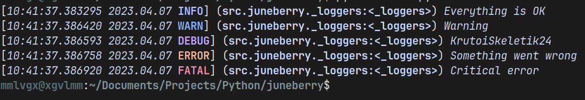

# juneberry
Lightweight Python logging without dependencies
# Install
`pip install juneberry`
# Examples
`examples/basic.py`
```py
import juneberry


logger = juneberry.Logger()

logger.info('Hello')
```
You can also use themes\
`examples/themes.py`
```py
from juneberry import Logger
from juneberry import Theme, Color, Effect
from juneberry import Message, Timestamp, Module


theme = Theme(
    Color.Converters.from_rgb(180, 190, 254),
    Color.Converters.from_rgb(137, 180, 250),
    Color.Converters.from_rgb(203, 166, 247),
    Color.Converters.from_rgb(250, 179, 135),
    Color.Converters.from_rgb(243, 139, 168),
    Module(Color.Converters.from_rgb(205, 214, 244), Effect.Standart.BOLD),
    Message(Color.Converters.from_rgb(205, 214, 244), Effect.Standart.ITALIC),
    Timestamp(Color.Converters.from_rgb(205, 214, 244), Effect.Standart.ITALIC),
)

logger = Logger(theme=theme)


logger.info("Everything is OK")
logger.warn("Warning")
logger.debug("KrutoiSkeletik24")
logger.error("Something went wrong")
logger.fatal("Critical error")
```
